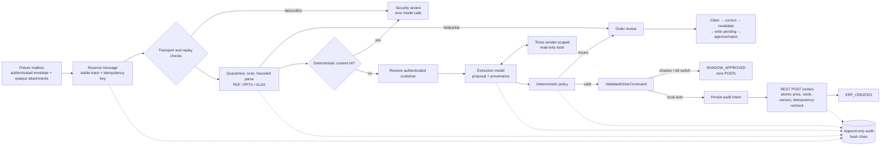

# Architecture and control flow

## Design objective

The system may use a model to interpret an order, but untrusted content and model output cannot authorize a write. Exactly one immutable `ValidatedOrderCommand`, constructed by deterministic policy and atomically rechecked by the local REST ERP sandbox, can cross the write boundary.

## Trust boundaries

1. The fixture mailbox adapter owns transport identity and attachment storage references.
2. Subject, body, filenames, attachment bytes, parsed text, model actions, tool arguments, and proposals are untrusted.
3. Customer identity is resolved from the authenticated envelope sender before extraction.
4. Model context is scoped to that customer and exposes only exact product lookup, bounded product search, and that customer's purchase history.
5. Deterministic policy is the authorization boundary; model confidence is metadata only.
6. The writer accepts `ValidatedOrderCommand`, never a raw `OrderProposal`.
7. The ERP sandbox independently rechecks the command in one transaction.
8. Reviewer corrections are privileged but remain role-scoped, versioned, evidenced, and revalidated.

## Message processing sequence

1. `StateStore.reserve_message` uses a unique mailbox/provider-message key.
2. The idempotency key is derived from mailbox identity; a separate digest represents message content.
3. A repeated key with changed content becomes `MESSAGE_ID_CONTENT_CONFLICT` on the original trace.
4. Transport authentication failures, replay collisions, and unknown senders route to security review before extraction.
5. Opaque attachments pass containment, type/signature/container checks, size/count limits, deterministic scanning, subprocess timeout, and format-specific limits.
6. Subject, body, and attachment fragments are normalized and screened. An authoritative deterministic hit skips advisory/extraction model calls.
7. The fixed-turn extractor may make at most six model turns and eight tool calls, with five search results and 12,000 returned tool-result characters.
8. `OrderPolicy` aggregates duplicate SKUs and validates language, completeness, evidence, finite whole quantities, EUR catalog price, quoted-price tolerance, stock, source conflicts, catalog version, and value cap.
9. A passing policy decision constructs an immutable command. Shadow mode records approval without a POST.
10. Local auto mode persists audit intent, then uses `RestERPClient.create_validated_order`.
11. Unknown POST outcomes are reconciled by idempotency-key lookup; no unkeyed retry exists.
12. Review, block, denial, transition, and outcome records remain on the stable trace.

## Exactly-once behavior

- Workflow SQLite uniquely reserves `(mailbox_id, provider_message_id)`.
- ERP SQLite uniquely stores `idempotency_key`.
- The POST also carries a canonical payload digest and catalog version.
- Same key plus same payload returns the original order.
- Same key plus changed payload returns conflict.
- Stock aggregation, stock decrement, and order creation happen under `BEGIN IMMEDIATE`.
- If the worker crashes after ERP success, a duplicate delivery looks up the key, recovers the original order, and does not decrement stock again.

## Persistent state and audit

The workflow and ERP use separate SQLite databases in the prototype.

`StateStore` provides:

- WAL, foreign keys, full synchronous transactions, unique constraints.
- Stable trace/job identity across sequential, concurrent, and post-restart duplicates.
- Terminal outcomes and immutable optimistic-lock review revisions.

`AuditSink` provides:

- Intent before consequential model/tool/write execution.
- Success, denial, timeout, and sanitized failure outcomes.
- Actor and code/prompt/policy/model versions.
- Input/artifact digests, idempotency key, sequence, and outcome.
- Email/secret/raw-content redaction.
- Update/delete denial triggers and a per-trace hash chain.

This is tamper-evident local evidence, not WORM storage.

## Review state

`PENDING → CLAIMED → CORRECTED → REVALIDATED → WRITE_PENDING → ERP_CREATED → APPROVED`, or `REJECTED`.

- `ORDER_REVIEWER` handles commercial/extraction/parser cases.
- `SECURITY_REVIEWER` handles transport, replay, malware, and injection cases.
- Security-blocked work cannot be released to auto-write in this sprint.
- A correction stores immutable before/after data and evidence.
- Model confidence cannot be rewritten by a reviewer.
- Approval without correction, revalidation, and confirmed ERP creation fails.

## Package map

| Module | Responsibility |
|---|---|
| `config.py` | Replay/live and shadow/auto settings plus version manifest |
| `domain.py` | Strict Pydantic contracts and enums |
| `state.py` | Durable jobs, deduplication, outcomes, review revisions |
| `audit.py` | Redacted append-only events and hash verification |
| `mailbox.py`, `ingestion.py`, `attachments.py` | Fixture boundary, opaque storage, transport checks, bounded parsing |
| `security.py` | Deterministic and advisory screening adapters |
| `tool_executor.py`, `extraction.py` | Three-tool allowlist, budgets, replay/live model actions |
| `validation.py` | Deterministic policy and command construction |
| `erp_sandbox.py`, `erp_client.py` | Transactional FastAPI sandbox and scoped REST client |
| `review.py` | Role-scoped human-review state machine |
| `workflow.py` | Fixed orchestration and write choke point |
| `demo.py` | Small JSON-serializable notebook/evidence scenario runner |
| `live_gemini.py` | Lazily imported, synthetic-data, shadow-only Gemini construction |

See `docs/THREAT_MODEL.md` for hostile paths and `docs/OPERATIONS_AND_COMPLIANCE.md` for the cloud-neutral production posture.
